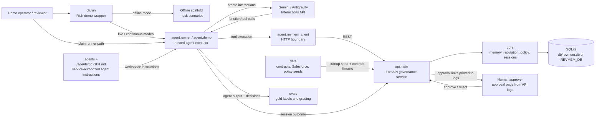

# RevMem

Governed context, reputation, and policy layer for autonomous finance agents. An agent reconciles contract pricing against CRM data, learns from human feedback across sessions, and earns broader autonomy as its reputation improves.

Built on hosted Gemini/Antigravity interactions, a local **FastAPI** governance engine, and a CLI runner that executes model-requested tools against the API.

## Prerequisites

- Python 3.11+
- [uv](https://docs.astral.sh/uv/) (recommended) or pip
- A Gemini API key ([aistudio.google.com/api-keys](https://aistudio.google.com/api-keys))
- ngrok (optional, only when approval links must be reachable outside localhost)

## Setup

```bash
git clone <repo-url> && cd aie
uv venv && source .venv/bin/activate
uv pip install -r requirements.txt

cp .env.example .env
# Edit .env:
#   GEMINI_API_KEY=...
#   REVMEM_BASE_URL=http://127.0.0.1:8000
#   REVMEM_STUB_MODE=0
```

---

## Runtime Pieces

- `api.main`: FastAPI service for agents, sessions, memory, policy, CRM writes, approval gates, and the service-owned MCP endpoint at `/mcp`. It initializes SQLite and seeds policy/CRM/demo data on startup. By default it writes `db/revmem.db`; set `REVMEM_DB` for an isolated database.
- `agent.runner`: lower-level hosted-agent executor. It creates Gemini/Antigravity interactions, injects static `.agents` guidance plus the service-generated `/agents/{id}/skill.md`, gives live agents the service MCP endpoint, and logs outcomes back to the API. Stub mode can still use local function declarations for offline tests.
- `agent.demo`: plain three-session wrapper around `agent.runner`.
- `cli.run`: primary demo entrypoint. Offline scaffold modes do not need Gemini or the API. Live and continuous modes use `agent.runner`, render a Rich terminal transcript, and require `GEMINI_API_KEY` plus a non-stub `REVMEM_BASE_URL`.

## Running the Demo

### 1. Start the RevMem API

Start this before any live hosted-agent run:

```bash
export REVMEM_BASE_URL=http://127.0.0.1:8000
export REVMEM_STUB_MODE=0
# Optional isolation:
# export REVMEM_DB=/tmp/revmem-demo.db

uv run uvicorn api.main:app --host 127.0.0.1 --port 8000
```

The API seeds policy, CRM, and the demo agent during startup. Do not run `data.seed` as a required boot step.

Live hosted-agent runs use the API's MCP endpoint by default:

```bash
# default for non-stub API runs
export REVMEM_TOOL_TRANSPORT=mcp

# optional fallback for local function declarations
export REVMEM_TOOL_TRANSPORT=function
```

The MCP server receives `x-revmem-agent-id` and `x-revmem-session-id` headers from `agent.runner`. It uses the DB-backed agent role and policy tables to filter tool discovery and authorize tool calls; `agent/` does not decide write access.

If port `8000` is already taken, pick another port and keep `REVMEM_BASE_URL` in sync:

```bash
export REVMEM_BASE_URL=http://127.0.0.1:8010
uv run uvicorn api.main:app --host 127.0.0.1 --port 8010
```

Approval links are printed by the API server logs. For links that need to work outside the local machine, expose the API and set the public URL before starting both the API process and the CLI:

```bash
export REVMEM_BASE_URL=https://<your-reserved>.ngrok.app
uv run uvicorn api.main:app --host 0.0.0.0 --port 8000

# In another terminal:
ngrok http 8000 --domain=<your-reserved>.ngrok.app
```

### Honcho Shortcut

The included `Procfile` starts the API and then starts the default live CLI agent after a short delay:

```bash
export GEMINI_API_KEY=...
honcho start
```

Honcho loads `.env` by default, so you can put `GEMINI_API_KEY`, `REVMEM_BASE_URL`, and `REVMEM_STUB_MODE=0` there instead of exporting them. Override `REVMEM_AGENT_START_DELAY` if your API needs more startup time, or set `REVMEM_AGENT_ARGS` for extra CLI flags:

```bash
REVMEM_AGENT_ARGS="--session 1 --debug-agent" honcho start
```

### Quick Start: `--continuous`

This is the hero mode: one continuous Antigravity interaction chain with live human correction in the middle.

Approval claims in final text are not treated as approval evidence. A compliant run must either call the service-authorized `route_for_approval` tool directly or attempt a governed service method such as `write_crm`; the service returns `approval_required` with an `approval_request_id` before any gated side effect runs.

For the local demo, human approvers can open unauthenticated inboxes such as `/approval-inbox/controller`, `/approval-inbox/cfo`, or `/approval-inbox/cco`. Each inbox shows pending approval links for that role. The approval form records approve/deny decisions plus comments; trusted reroute comments that mention another known persona can create the next approval task.

In a second terminal:

```bash
export GEMINI_API_KEY=...
export REVMEM_BASE_URL=http://127.0.0.1:8000
export REVMEM_STUB_MODE=0

uv run python -m cli.run --continuous
```

#### What Happens

```text
Step 1: Acme Corp - agent has no prior memories
  -> Agent reconciles contract vs CRM with full data + DOA policy
  -> Agent catches discrepancies but may over-escalate or mis-route
  -> Graded against gold labels

Step 2: Human reviewer feedback
  -> You type what the agent got wrong, or press Enter for a default
  -> Feedback is sent as a new interaction in the same chain
  -> Agent autonomously calls store_memory to persist the lesson

Step 3: Globex Inc - testing generalization
  -> New deal, same agent, same interaction chain
  -> Agent calls retrieve_context and finds the lesson from Step 2
  -> Agent applies the learned rule to a deal it has never seen
  -> Should route correctly and dismiss noise
```

Key talking points:

- All three steps share one `environment_id`, giving true Antigravity state continuity.
- Human correction is real typed input, not hardcoded.
- The agent decides what to store via `store_memory`.
- The lesson generalizes from Acme to unseen Globex deal.
- Reputation expands permissions as accuracy improves.

Default feedback if you press Enter:

> The $0.33 monthly invoice difference is a rounding artifact - per DOA-001, differences under $1 should be auto-dismissed, not escalated. Also, the annual schedule mismatch is a schedule_change and should be routed to the Controller per DOA-003, not the CFO.

### Other CLI Live Modes

`--live` runs the hosted agent through the Rich CLI transcript. It refuses to run if `REVMEM_BASE_URL` is empty unless you explicitly pass `--allow-stub-live`.

```bash
uv run python -m cli.run --live                         # default: session 3
uv run python -m cli.run --live --session 1             # Acme cold-start session
uv run python -m cli.run --live --session 3             # Globex learned/generalization session
uv run python -m cli.run --live --all                   # sessions 1 -> 2 -> 3
uv run python -m cli.run --live --runs 5                # seed, then repeat learned trials
uv run python -m cli.run --live --fast --no-wait        # local smoke run without approval polling
uv run python -m cli.run --live --debug-agent           # print Interactions API step debugging
```

Use `--agent-name` to isolate a run. Use `--reuse-agent` when you intentionally want reputation and memories to accumulate on the default demo agent.

### Lower-Level Agent Runner

Use `agent.runner` when you want the plain hosted-agent executor without the Rich CLI wrapper:

```bash
export GEMINI_API_KEY=...
export REVMEM_BASE_URL=http://127.0.0.1:8000
export REVMEM_STUB_MODE=0

uv run python -m agent.runner --session 1
uv run python -m agent.runner --session 3 --agent-name "RevOps Finance Agent debug"
uv run python -m agent.demo
```

`agent.runner` accepts `--env-id` and `--prev-interaction` for manually chaining hosted interactions, plus `--debug` for Interactions API timing and step details.

### Offline Scaffold

No API key or API server is needed. Leave `REVMEM_BASE_URL` empty or set `REVMEM_STUB_MODE=1`.

```bash
uv run python -m cli.run                       # scaffold S3
uv run python -m cli.run --session s1           # scaffold S1
uv run python -m cli.run --fast --all           # fast noninteractive scaffold
```

---

## Running Tests

```bash
# All tests
uv run python -m pytest -v

# Just the eval grading tests
uv run python -m pytest evals/test_grade.py -v

# Full eval harness, generates evals/report.json
uv run python -m evals.run
```

---

## Project Structure

The runtime wiring is:



```text
├── .agents/                         # Antigravity agent config
│   ├── AGENTS.md                    # Hosted-agent persona and feedback rules
│   └── skills/reconciliation/       # Reconciliation skill used by the hosted agent
├── .codex/                          # Local Codex workspace config
├── .cursor/                         # Cursor MCP config
├── .zed/                            # Zed editor config
├── .env.example                     # Demo environment template
├── .gitignore                       # Ignored local runtime artifacts
├── .mcp.json                        # MCP server config
├── opencode.json                    # OpenCode agent config
├── ARCHITECTURE.md                  # Architecture notes
├── prd.md                           # Product requirements
├── spec.md                          # Demo/product spec
├── agent/                           # Gemini/Antigravity integration path
│   ├── runner.py                    # Hosted-agent session executor
│   ├── demo.py                      # Three-session agent demo wrapper
│   ├── prompts.py                   # Reconciliation and feedback prompt builders
│   ├── scenarios.py                 # Deal configs and expected outcomes
│   ├── tools.py                     # Legacy function declarations used in stub/fallback mode
│   ├── tool_types.py                # Shared tool evidence types
│   ├── revmem_client.py             # HTTP client for the RevMem API
│   ├── spike.py                     # Local proof-of-concept spike script
│   ├── templates/                   # Static AGENTS.md loader for hosted environments
│   └── data/                        # Agent-local Acme/Globex contract, CRM, and policy fixtures
├── api/                             # FastAPI service boundary
│   ├── main.py                      # App factory, SQLite lifecycle, and seed loading
│   ├── routes.py                    # Agents, sessions, memory, CRM, policy, and approval routes
│   └── approval_gate.py             # Route/method approval gate helper
├── core/                            # SQLite memory, reputation, policy, session, and governance logic
│   ├── approval_policy.py           # Approval requirements, joins, and dependency rules
│   ├── context.py                   # Memory retrieval and embedding helpers
│   ├── database.py                  # SQLite schema and persistence helpers
│   ├── governance.py                # Tool permissions, routing, and tier behavior
│   ├── models.py                    # Pydantic domain models
│   ├── reputation.py                # Reputation scoring and tier calculation
│   └── session.py                   # Session lifecycle and memory reinforcement
├── data/                            # Canonical API seed data and fixture loader
│   ├── contracts.json
│   ├── salesforce.json
│   ├── policy.json
│   └── seed.py
├── cli/                             # Rich terminal demo path
│   ├── run.py                       # --continuous / --live / scaffold modes
│   └── render.py                    # Rich panels, tables, and status rendering
├── evals/                           # Continual-learning evaluation harness
│   ├── behaviors.py                 # Expected behavior definitions
│   ├── gold.py                      # Gold-label generation
│   ├── grade.py                     # Output grading logic
│   ├── harness.py                   # Eval orchestration helpers
│   ├── report.py                    # Report generation
│   ├── run.py                       # Full eval runner
│   └── test_grade.py                # Eval grading tests
├── docs/
│   ├── adr/                         # Architecture decision records
│   └── superpowers/plans/           # Saved implementation plans
├── tests/                           # Unit and API coverage for core, agent, CLI, seed, and governance paths
├── pytest.ini                       # Pytest configuration
└── requirements.txt                 # Runtime and test dependencies
```

## Key Concepts

- **Reputation tiers**: OBSERVER (0.0-0.3) -> ANALYST (0.3-0.6) -> AUTONOMOUS (0.6-1.0). The DB-backed agent row stores the current tier; the API returns `allowed_tools` and `/agents/{id}/skill.md`, and live hosted agents call the service-owned MCP endpoint so policy is enforced in the service layer.
- **Approval gate**: Service-enforced at the route/method level. Each side-effect method has an explicit approval policy defining whether approval is required, whether approvers are `any` or `all`, and whether one approval depends on another. Service methods either execute, return `approval_required` with an `approval_request_id`, or reject the request. The runner only displays and records service results.
- **Continual learning**: Human feedback -> agent stores lesson via `store_memory` -> future sessions retrieve via `retrieve_context` -> behavior improves.
- **Continuous interaction chain**: `--continuous` keeps one `environment_id` and chains via `previous_interaction_id`, so the agent's cognitive state evolves within a single Antigravity session.

## License

MIT
