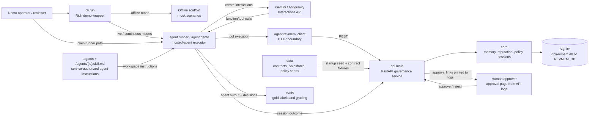

# RevMem

Governed context, reputation, and policy layer for autonomous finance agents. An agent reconciles contract pricing against CRM data, learns from human feedback across sessions, and earns broader autonomy as its reputation improves.

Built on hosted Gemini/Antigravity interactions, a local **FastAPI** governance engine, and a CLI runner that executes model-requested tools against the API.

## Prerequisites

- Python 3.11+
- [uv](https://docs.astral.sh/uv/) (recommended) or pip
- A Gemini API key ([aistudio.google.com/api-keys](https://aistudio.google.com/api-keys))
- ngrok (optional, only when approval links must be reachable outside localhost)

## Setup

```bash
git clone <repo-url> && cd aie
uv venv && source .venv/bin/activate
uv pip install -r requirements.txt

cp .env.example .env
# Edit .env:
#   GEMINI_API_KEY=...
#   REVMEM_BASE_URL=http://127.0.0.1:8000
#   REVMEM_STUB_MODE=0
#   REVMEM_TOOL_TRANSPORT=mcp
#   REVMEM_STREAM=1          # optional: live SSE visibility for the demo
```

---

## Runtime Pieces

- `api.main`: FastAPI service for agents, sessions, memory, policy, CRM writes, approval gates, and the service-owned MCP endpoint at `/mcp`. It initializes SQLite and seeds policy/CRM/demo data on startup. By default it writes `db/revmem.db`; set `REVMEM_DB` for an isolated database.
- `agent.runner`: lower-level hosted-agent executor. It creates Gemini/Antigravity interactions, injects static `.agents` guidance plus the service-generated `/agents/{id}/skill.md`, gives live agents the service MCP endpoint, and logs outcomes back to the API. Stub mode can still use local function declarations for offline tests.
- `agent.demo`: plain three-session wrapper around `agent.runner`.
- `cli.run`: primary demo entrypoint. Offline scaffold modes do not need Gemini or the API. Live and continuous modes use `agent.runner`, render a Rich terminal transcript, and require `GEMINI_API_KEY` plus a non-stub `REVMEM_BASE_URL`.

## Running the Demo

### 1. Configure `.env`

Live demo commands should be run through Honcho so `.env` is the source of truth:

```bash
GEMINI_API_KEY=...
REVMEM_BASE_URL=http://127.0.0.1:8000
REVMEM_STUB_MODE=0
REVMEM_TOOL_TRANSPORT=mcp
REVMEM_STREAM=1
REVMEM_DB=/tmp/revmem-demo.db
REVMEM_PORT=8000
```

`REVMEM_STREAM=1` is optional, but it is the recommended demo setting: the hosted-agent turn streams SSE events such as `thought`, `function_call`, and `function_result` instead of hiding progress behind background polling. Leave it unset or set it to `0` to keep the default background-poll mode.

### 2. Start the RevMem API

Start this before any live hosted-agent run:

```bash
honcho start api
```

The API seeds policy, CRM, and the demo agent during startup. Do not run `data.seed` as a required boot step.

Live hosted-agent runs use the API's MCP endpoint by default:

```bash
REVMEM_TOOL_TRANSPORT=mcp
# REVMEM_TOOL_TRANSPORT=function  # optional fallback for local function declarations
```

The MCP server receives `x-revmem-agent-id` and `x-revmem-session-id` headers from `agent.runner`. It uses the DB-backed agent role and policy tables to filter tool discovery and authorize tool calls; `agent/` does not decide write access.

If port `8000` is already taken, pick another port and keep `REVMEM_BASE_URL` in sync in `.env`:

```bash
REVMEM_BASE_URL=http://127.0.0.1:8010
REVMEM_PORT=8010
```

Approval links are printed by the API server logs. For links that need to work outside the local machine, expose the API and set the public URL before starting both the API process and the CLI:

```bash
REVMEM_BASE_URL=https://<your-reserved>.ngrok.app
REVMEM_NGROK_URL=https://<your-reserved>.ngrok.app
REVMEM_PORT=8000
```

```bash
honcho start api

# In another terminal:
ngrok http 8000 --domain=<your-reserved>.ngrok.app
```

### Honcho Shortcut

Honcho loads `.env` by default. For local demos, run the API process and the CLI separately so you can keep approval inboxes visible:

```bash
honcho start api
```

The full `honcho start` path is for ngrok-backed runs where `.env` also defines `REVMEM_NGROK_URL`; the `agent` Procfile process waits on that URL.

Run one-off commands with `.env` loaded through `honcho run`:

```bash
honcho run uv run python -m cli.run --continuous
```

### Hero Mode: `--self-heal`

Governed recursive self-improvement. The agent's reputation is derived from its eval score; a bad run tanks it below the production floor and a server-enforced circuit breaker locks the agent out of CRM writes. The system then diagnoses the failure, an optimizer (Gemini 3.5 Flash) rewrites the agent's own skill prompt, re-scores it (keeping the edit only if the eval improves), reputation recovers, and production access is restored.

```bash
export GEMINI_API_KEY=...
export REVMEM_BASE_URL=http://127.0.0.1:8000
export REVMEM_STUB_MODE=0

uv run python -m cli.run --self-heal
```

#### What Happens

```text
1. Seed         A fresh agent with a shaky record (reputation ~0.33, ANALYST).
2. Bad run      It reconciles on a regressed skill and botches it -> accuracy 0.
3. Lock         Reputation drops to ~0.25 (OBSERVER). write_crm returns
                PRODUCTION LOCKED (403, server-enforced, not a prompt).
4. Self-heal    The optimizer scores the skill, rewrites it (live Gemini 3.5
                Flash, with a deterministic fallback), and re-scores it on an
                accept-if-better basis. The self-authored SKILL.md diff is shown.
5. Recover      Reputation recovers above the floor (~0.50, ANALYST). Production
                access is restored, and the recovery run uses the rewritten skill.
```

Key points:
- The reputation circuit breaker is enforced in `api/routes.py::write_crm` (`core/circuit_breaker.py`), not by the agent.
- Skill versions are persisted in the `skill_versions` table; the optimizer (`core/optimizer.py`) writes a new active version and `GET /agents/{id}/skill.md` serves it.
- The optimizer's objective function is a prompt-sensitive worker scorer (`evals/worker.py`, Gemini 3.5 Flash) that reuses the existing grader and gold labels. The offline harness is prompt-blind, so this is what gives the loop real signal.
- Reputation is genuinely derived from the eval score via `reputation.set_reputation_from_eval`.

### Quick Start: `--continuous`

This is the original hero mode: one continuous Antigravity interaction chain with live human correction in the middle.

Approval claims in final text are not treated as approval evidence. A compliant run must call the service-authorized `route_for_approval` tool when it does not have CRM-write access. Only agents whose `allowed_tools` includes `write_crm` may attempt that governed service method; approval alone does not grant an analyst CRM write access.

For the local demo, human approvers can open unauthenticated inboxes. With the default `REVMEM_BASE_URL=http://127.0.0.1:8000`, use:

- Controller: <http://127.0.0.1:8000/approval-inbox/controller>
- CFO: <http://127.0.0.1:8000/approval-inbox/cfo>
- CCO: <http://127.0.0.1:8000/approval-inbox/cco>
- Finance admin: <http://127.0.0.1:8000/approval-inbox/finance_admin>
- AM: <http://127.0.0.1:8000/approval-inbox/am>

Each inbox shows pending approval links for that role. The approval form records approve/deny decisions plus comments; trusted reroute comments that mention another known persona can create the next approval task.

In a second terminal:

```bash
honcho run uv run python -m cli.run --continuous
```

If `REVMEM_STREAM` is not set in `.env`, add `--stream` for the same live SSE visibility:

```bash
honcho run uv run python -m cli.run --continuous --stream
```

#### What Happens

```text
Step 1: Acme Corp - agent has no prior memories
  -> Agent reconciles contract vs CRM with full data + DOA policy
  -> Agent catches discrepancies but may over-escalate or mis-route
  -> Graded against gold labels

Step 2: Human reviewer feedback
  -> You type what the agent got wrong, or press Enter for a default
  -> Feedback is sent as a new interaction in the same chain
  -> Agent autonomously calls store_memory to persist the lesson

Step 3: Globex Inc - testing generalization
  -> New deal, same agent, same interaction chain
  -> Agent calls retrieve_context and finds the lesson from Step 2
  -> Agent applies the learned rule to a deal it has never seen
  -> Should route correctly and dismiss noise
```

Key talking points:

- All three steps share one `environment_id`, giving true Antigravity state continuity.
- Streaming mode shows each hosted-agent step as it happens: `thought`, `function_call`, and `function_result`.
- Human correction is real typed input, not hardcoded.
- The agent decides what to store via `store_memory`.
- The lesson generalizes from Acme to unseen Globex deal.
- Reputation expands permissions as accuracy improves.

Default feedback if you press Enter:

> The $0.33 monthly invoice difference is a rounding artifact - per DOA-001, differences under $1 should be auto-dismissed, not escalated. Also, the annual schedule mismatch is a schedule_change and should be routed to the Controller per DOA-003, not the CFO.

### Other CLI Live Modes

`--live` runs the hosted agent through the Rich CLI transcript. It refuses to run if `REVMEM_BASE_URL` is empty unless you explicitly pass `--allow-stub-live`.

```bash
honcho run uv run python -m cli.run --live                         # default: session 3
honcho run uv run python -m cli.run --live --session 1             # Acme cold-start session
honcho run uv run python -m cli.run --live --session 3             # Globex learned/generalization session
honcho run uv run python -m cli.run --live --all                   # sessions 1 -> 2 -> 3
honcho run uv run python -m cli.run --live --runs 5                # seed, then repeat learned trials
honcho run uv run python -m cli.run --live --stream                # live SSE step visibility
honcho run uv run python -m cli.run --live --fast --no-wait        # local smoke run without approval polling
honcho run uv run python -m cli.run --live --debug-agent           # print Interactions API step debugging
```

Use `--agent-name` to isolate a run. Use `--reuse-agent` when you intentionally want reputation and memories to accumulate on the default demo agent.

### Lower-Level Agent Runner

Use `agent.runner` when you want the plain hosted-agent executor without the Rich CLI wrapper:

```bash
honcho run uv run python -m agent.runner --session 1
honcho run uv run python -m agent.runner --session 1 --stream
honcho run uv run python -m agent.runner --session 3 --agent-name "RevOps Finance Agent debug"
honcho run uv run python -m agent.demo
```

`agent.runner` accepts `--env-id` and `--prev-interaction` for manually chaining hosted interactions, plus `--debug` for Interactions API timing and step details.

### Offline Scaffold

No API key or API server is needed. Leave `REVMEM_BASE_URL` empty or set `REVMEM_STUB_MODE=1`.

```bash
uv run python -m cli.run                       # scaffold S3
uv run python -m cli.run --session s1           # scaffold S1
uv run python -m cli.run --fast --all           # fast noninteractive scaffold
```

---

## Running Tests

```bash
# All tests
uv run python -m pytest -v

# Just the eval grading tests
uv run python -m pytest evals/test_grade.py -v

# Full eval harness, generates evals/report.json
uv run python -m evals.run curve

# Retrieval-quality eval
uv run python -m evals.run retrieval

# Live learning curve from the .env-selected DB/API
honcho run uv run python -m evals.run live --source db
```

---

## Project Structure

The runtime wiring is:



```text
├── .agents/                         # Antigravity agent config
│   ├── AGENTS.md                    # Hosted-agent persona and feedback rules
│   └── skills/reconciliation/       # Reconciliation skill used by the hosted agent
├── .codex/                          # Local Codex workspace config
├── .cursor/                         # Cursor MCP config
├── .zed/                            # Zed editor config
├── .env.example                     # Demo environment template
├── .gitignore                       # Ignored local runtime artifacts
├── .mcp.json                        # MCP server config
├── opencode.json                    # OpenCode agent config
├── ARCHITECTURE.md                  # Architecture notes
├── prd.md                           # Product requirements
├── spec.md                          # Demo/product spec
├── agent/                           # Gemini/Antigravity integration path
│   ├── runner.py                    # Hosted-agent session executor
│   ├── demo.py                      # Three-session agent demo wrapper
│   ├── prompts.py                   # Reconciliation and feedback prompt builders
│   ├── scenarios.py                 # Deal configs and expected outcomes
│   ├── tools.py                     # Legacy function declarations used in stub/fallback mode
│   ├── tool_types.py                # Shared tool evidence types
│   ├── revmem_client.py             # HTTP client for the RevMem API
│   ├── spike.py                     # Local proof-of-concept spike script
│   ├── templates/                   # Static AGENTS.md loader for hosted environments
│   └── data/                        # Agent-local Acme/Globex contract, CRM, and policy fixtures
├── api/                             # FastAPI service boundary
│   ├── main.py                      # App factory, SQLite lifecycle, and seed loading
│   ├── routes.py                    # Agents, sessions, memory, CRM, policy, and approval routes
│   └── approval_gate.py             # Route/method approval gate helper
├── core/                            # SQLite memory, reputation, policy, session, and governance logic
│   ├── approval_policy.py           # Approval requirements, joins, and dependency rules
│   ├── context.py                   # Memory retrieval and embedding helpers
│   ├── database.py                  # SQLite schema and persistence helpers
│   ├── governance.py                # Tool permissions, routing, and tier behavior
│   ├── models.py                    # Pydantic domain models
│   ├── reputation.py                # Reputation scoring and tier calculation
│   └── session.py                   # Session lifecycle and memory reinforcement
├── data/                            # Canonical API seed data and fixture loader
│   ├── contracts.json
│   ├── salesforce.json
│   ├── policy.json
│   └── seed.py
├── cli/                             # Rich terminal demo path
│   ├── run.py                       # --continuous / --live / scaffold modes
│   └── render.py                    # Rich panels, tables, and status rendering
├── evals/                           # Continual-learning evaluation harness
│   ├── behaviors.py                 # Expected behavior definitions
│   ├── gold.py                      # Gold-label generation
│   ├── grade.py                     # Output grading logic
│   ├── harness.py                   # Eval orchestration helpers
│   ├── report.py                    # Report generation
│   ├── run.py                       # Full eval runner
│   └── test_grade.py                # Eval grading tests
├── docs/
│   ├── adr/                         # Architecture decision records
│   └── superpowers/plans/           # Saved implementation plans
├── tests/                           # Unit and API coverage for core, agent, CLI, seed, and governance paths
├── pytest.ini                       # Pytest configuration
└── requirements.txt                 # Runtime and test dependencies
```

## Key Concepts

- **Reputation tiers**: OBSERVER (0.0-0.3) -> ANALYST (0.3-0.6) -> AUTONOMOUS (0.6-1.0). ANALYST can route approvals, poll approval status, and store lessons, but cannot mutate CRM; `write_crm` is AUTONOMOUS-only and still approval-gated for judgment changes. The DB-backed agent row stores the current tier; the API returns `allowed_tools` and `/agents/{id}/skill.md`, and live hosted agents call the service-owned MCP endpoint so policy is enforced in the service layer.
- **Approval gate**: Service-enforced at the route/method level. Each side-effect method has an explicit approval policy defining whether approval is required, whether approvers are `any` or `all`, and whether one approval depends on another. Service methods either execute, return `approval_required` with an `approval_request_id`, or reject the request. The runner only displays and records service results.
- **Continual learning**: Human feedback -> agent stores lesson via `store_memory` -> future sessions retrieve via `retrieve_context` -> behavior improves.
- **Continuous interaction chain**: `--continuous` keeps one `environment_id` and chains via `previous_interaction_id`, so the agent's cognitive state evolves within a single Antigravity session.

## License

MIT
